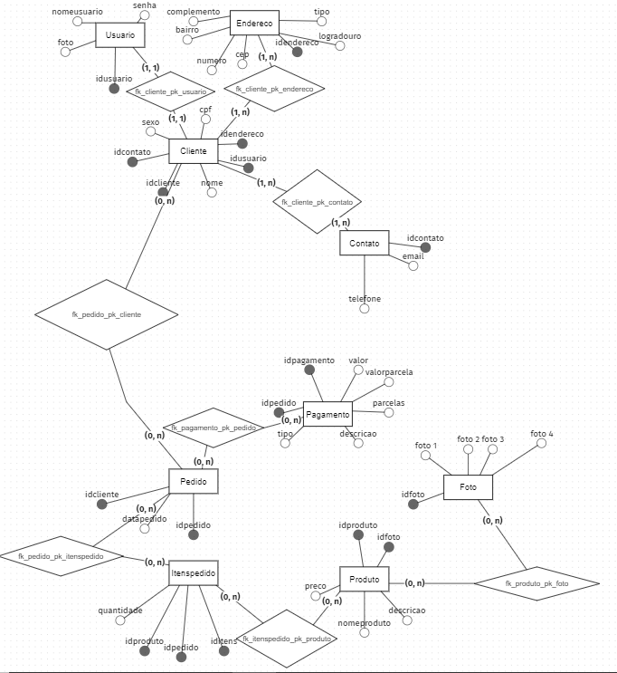
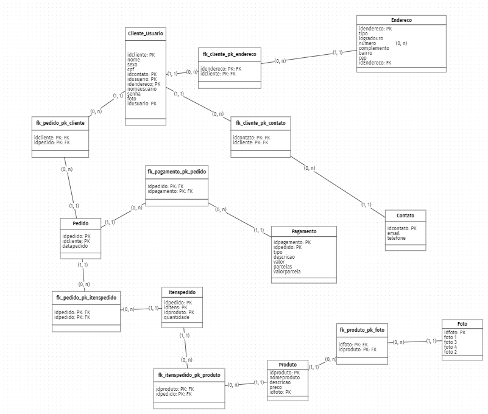
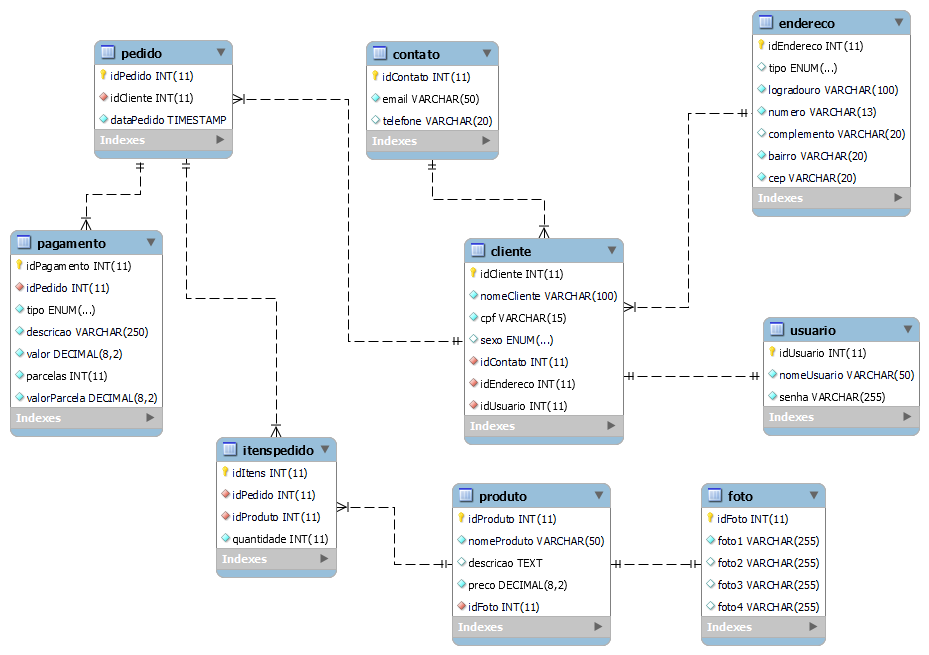

# Documentação do banco de dados kibaratu no MySQL
### Nesse readme você vai acompanhar todo o processo para a criação de um banco de dados, aqui estamos simulando de uma loja fantasiosa chamada kibaratu. Você irá ver desde o modelo conceitual até o modelo lógico.

-----


-----

## Na criação desse banco foi utilizado os seguintes recursos: XAMPP, MySQL Workbench e o BR Modelo Web.

> XAMPP foi usado pra subir o banco de dados no MYSQL.

> MYSQL Workbench foi a ferramenta essencial porque nele conseguimos fazer a modelagem no banco de dados, administrar ele e armazenar os dados do banco na máquina.

> BR Modelo Web foi utilizado para fazermos a parte lógica como diagramas do jeito que preferir.

----------------


---------------

# Modelo conceitual do banco

Um modelo conceitual é uma representação independente de tecnologia e linguagem de programação que serve como ponto de partida para a criação de modelos de dados mais detalhados, como modelos lógicos e físicos. Ele pode ser criado usando uma variedade de ferramentas, incluindo diagramas entidade-relacionamento (ER) e mapas conceituais. O objetivo final de um modelo conceitual é criar um design de banco de dados claro e bem organizado que possa ser implementado em um sistema de gerenciamento de banco de dados.

Nesse caso de padronização do banco de dados separamos da seguinte maneira: 

    •  Usuário
    •  Endereço
    •  Contato
    •  Cliente
    •  Produtos
    •  Fotos
    •  Pedido
    •  Itens Pedidos
    •  Pagamento

 Agora para a construção do modelo conceitual vamos para a ferramenta BR Modelo Web para a criação dele




----

# Modelo Lógico do banco

O modelo lógico de um banco de dados é uma representação abstrata da estrutura do banco de dados que descreve os dados e as relações entre eles. Ele define as tabelas, colunas, chaves e restrições que fazem parte do esquema do banco de dados. Ao contrário do modelo conceitual, o modelo lógico se preocupa com os detalhes internos do banco de dados e se concentra em como os dados serão armazenados e recuperados de maneira eficiente.

No mesmo site que fizemos o modelo conceitual podemos transformar ele em Lógico no canto superior direito que vai abrir outra guia transformando ele em tabelas como abaixo:



----

# Utilização das chaves no banco de dados

## Chave estrangeira, chave primária e chave única são conceitos importantes em banco de dados relacionais.

A chave primária é um atributo ou conjunto de atributos que identifica unicamente cada registro em uma tabela. Por exemplo, em uma tabela de clientes, a chave primária pode ser o número de identificação do cliente, garantindo que cada cliente tenha um identificador exclusivo na tabela.

 A chave estrangeira é um atributo ou conjunto de atributos que faz referência à chave primária de outra tabela. Por exemplo, em uma tabela de pedidos, a chave estrangeira pode ser o número de identificação do cliente, referenciando a chave primária da tabela de clientes. Isso permite estabelecer relações entre tabelas e recuperar informações relacionadas.

 A chave única é um atributo ou conjunto de atributos que garante que não haja registros duplicados em uma tabela. Ou seja, cada valor da chave única deve ser único na tabela, mas não necessariamente precisa identificar unicamente cada registro, como a chave primária. 

## Exemplo das chaves imagem abaixo que foi feita no excel categorizada por cores para melhor entendimento


---

# Modelo Físico do banco

 É a fase final do processo de modelagem de dados e é responsável por definir como os dados serão armazenados e organizados fisicamente em dispositivos de armazenamento, como discos rígidos, esse modelo de implementação utilizado no MYSQL é o DDL que nos permite criação e modificação da modelagem do nosso banco de dados.

### Para criarmos a parte física precisaremos dos aplicativos XAMPP e do MYSQL Workbench. 

Agora vamos para os códigos nesse contexto da loja para a criação da parte física
```
/* 
Como primeiro comando vamos dizer ao MySQL para criar um novo banco de dados com a seguinte sintaxe:
CREATE DATABASE nome_do_banco
*/
```
```
CREATE DATABASE kibaratu;
```
```
/*
Logo em seguida vamos informar ao MySQL que desejamos utilizar o banco de dados que acabamos de criar como seguinte comando:
USE nome_do_banco
*/
```
```
USE kibaratu;
```
```
/*
Agora já temos o nosso banco criado e também já estamos com ele selecionado, então agora podemos começar a criar nossas tabelas.
O comando para a criação das tabelas é CREATE TABLE nome_da_tabela;
Lembre-se vamos criar nossas tabelas e seus campos com base no que foi desenhado nas etapas anteriores.
Com isto vamos continuar nossa construção. 
*/
```
```
CREATE TABLE usuario(
    idUsuario int auto_increment primary key,
    nomeUsuario varchar(50) not null unique,
    senha varchar(255) not null
);
```
```
CREATE TABLE endereco(
    idEndereco int auto_increment primary key,
    tipo enum("Rua", "Avenida", "Travessa", "Alameda", "Viela"),
    logradouro varchar(100) not null,
    complemento varchar(20),
    bairro varchar(20) not null,
    cep varchar(20)
);
```
```
CREATE TABLE contato(
    idContato int auto_increment primary key,
    email varchar(50) not null unique,
    telefone varchar(20) not null
);
```
```
CREATE TABLE cliente(
    idCliente int auto_increment primary key,
    nomeCliente varchar(100) not null,
    cpf varchar(15) not null unique,
    sexo enum("Masculino", "Feminino", "Outros"),
    idContato int not null,
    idEndereco int not null,
    idUsuario int not null
);
```
```
CREATE TABLE produto(
    idProduto int auto_increment primary key,
    nomeProduto varchar(50) not null,
    descricao text not null,
    preco decimal(8.2) not null,
    idFoto int not null
);
```
```
CREATE TABLE foto(
    idFoto int auto_increment primary key,
    foto1 varchar(255) not null unique,
    foto2 varchar(255),
    foto3 varchar(255),
    foto4 varchar(255)
);
```
```
CREATE TABLE pedido(
    idPedido int auto_increment primary key,
    idCliente int not null,
    dataPedido timestamp default current_timestamp
);
```
```
CREATE TABLE itenspedido(
    idItens int auto_increment primary key,
    idPedido int not null,
    idProduto int not null,
    quantidade int not null
);
```
```
CREATE TABLE pagamento(
    idPagamento int auto_increment primary key,
    idPedido int not null,
    tipo enum("Crédito", "Débito", "Pix", "Boleto", "Transferência"),
    decricao varchar(250) not null,
    valor decimal(8.2) not null,
    parcelas int not null,
    valorParcela decimal(8.2) not null
);
```
---



Está imagem ela é feita no MYSQL Workbench após a criação dos codigos, a utilidade das tabelas graficas são ilustrar as ligações entre as tabelas e suas propriedades.

### Agora nosso banco de dados já está pronto!!!!